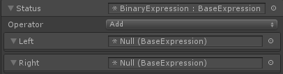
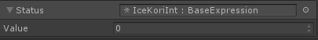
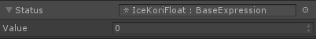
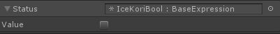
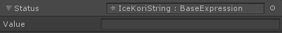
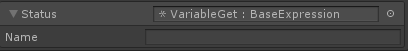
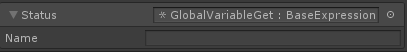
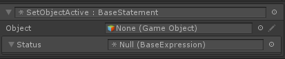

# Command 指令
本节介绍了所有内置的 IceKori 指令。

## 表达式节点
**注意**: 所有的表达式节点都只能定义在指令内部。

### `BinaryExpression` 节点
> 二元表达式


+ `Operator` BinaryOperator `enum` 操作符。
    + `BinaryOperator.Add` 相加
    + `BinaryOperator.Sub` 相减
    + `BinaryOperator.Mul` 相乘
    + `BinaryOperator.Div` 相除
    + `BinaryOperator.Mod` 取余
    + `BinaryOperator.Concat` 字符串连接
    + `BinaryOperator.Less` 小于
    + `BinaryOperator.LessEqual` 小于等于
    + `BinaryOperator.Equal` 等于
    + `BinaryOperator.MoreEqual` 大于等于
    + `BinaryOperator.More` 大于
    + `BinaryOperator.NotEqual` 不等于
    + `BinaryOperator.And` 逻辑和
    + `BinaryOperator.Or` 逻辑或

+ `Left` BaseExpression 左操作数
+ `Right` BaseExpression 右操作数

### 数据类型节点
> 这些节点表示了 IceKori 的数据类型，其本质是对 c# 对应对象的装箱。

#### `IceKoriInt`

#### `IceKoriFloat`

#### `IceBool`

#### `IceKoriString`

#### `IceKoriObject`
> 用来封装 c3 的引用类型。

**`IceKoriSprite`** Unity Sprite 对象的封装。

**`IceKoriTexture`** Unity Sprite 对象的封装。

**`IceKoriColor`** Unity Sprite 对象的封装。

**`IceKoriGameObject`** Unity GameObject 对象的封装。

### 错误节点
> 表示一个 IceKori 的错误对象。

在表达式里出现一个错误节点时，默认为抛出了一个对应的错误。

**`TypeError`** 当出现错误的类型调用时抛出此异常。
    
**`ReferenceError`** 当访问的字面值未定义，或者定义已定义的字面值时抛出此异常。

### 变量访问节点
#### `VariableGet`

#### `GlobalVariableGet`


## 逻辑指令
### `IfStatement`
> 条件判断指令，若结果为真，执行 Consequence, 否则执行 Alternative


+ `Condition` Expression 欲判断的条件
+ `Consequence` List\<BaseStatement>
+ `Alternative` List\<BaseStatement>

### `ForStatement`

### `WhileStatement`

## 错误

### `TryCatch`

### `Throw`

抛出异常。

## 变量定义指令
### `Define`
> 定义一个变量。

### `GlobalDefine`
> 定义一个全局变量。

## 其他指令
### `Display`

### `DebugPrint`


## gameplay 指令

### `SetObjectActive`
> 设置 GameObject 的状态。



+ `Object` GameObject - 欲修改的 GameObject 对象
+ `Status` BaseExpression - 要修改的状态。可以通过一个 `IceKoriBool` 节点来直接指定，或者通过二元表达式计算得出，亦或者访问某个变量/全局变量。需要注意的是，后两种情况需要确保最后获取的是一个 `IceKoriBool` 节点对象。否则会触发 `TypeError` 错误。

该指令等价于如下代码：
```
Object.SetActive(Status)
```

## 内部指令*
> 这些指令并不能在外部创建。只会在解释器实际运行的时候创建出来用以辅助。

### `Sequence`
> 顺序语句指令。解释器会把所有的 `List<BaseSteament>` 对象转换成一个 `Sequence` 后再进行规约。
### `EvalCallback`
> 执行到该指令时，会运行其所定义的 c# 回调函数。
### `DoNothing`
> 表示什么都不做。当解释器的 `Statement` 是一个 `DoNothing` 节点时，意味着程序运行结束。