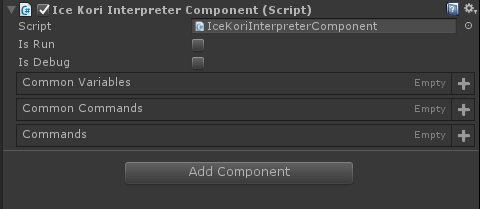
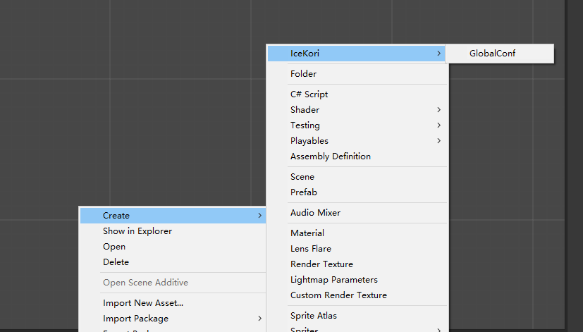
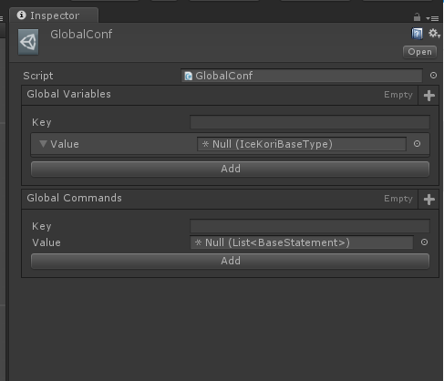

# IceKori

IceKori 是一个为便于游戏剧情脚本等轻量级逻辑抽象系统而实现的可视化编程语言。IceKori 依赖于 [Odin Inspector](http://sirenix.net/odininspector) 插件 。
需要说明的是， IceKori 并不是一个开箱即用的插件，其本身只包含了基本的的语言抽象节点。而与游戏系统强耦合的功能性指令需要依据提供的范式来二次开发。

## 指令说明
[Command](./Command.md)

## 自定义指令
[CustomCommand](./CustomCommand.md)

## IceKori 解释器
### 示例 
```c#
using Assets.Plugins.IceKori.Syntax;

// Some code

// create a IceKori interpreter
Interpreter interpreter = new Interpreter(commonVariables, commonCommands, globalVariables, globalCommands, commands)

```

### `new Interpreter(commonVariables, commonCommands, globalVariables, globalCommands, commands)`

+ `commonVariables` Dictionary<string, BaseExpression> - 公共变量
+ `commonCommands` Dictionary<string, IceKoriBaseType> - 公共指令
+ `globalVariables` Dictionary<string, List\<BaseStatement>> - 全局公共变量
+ `globalCommands` Dictionary<string, IceKoriBaseType> - 全局公共指令
+ `commands` List\<BaseStatement> - 指令

### 实例属性

#### `State` InterpreterState `enum`
解释器的状态。有四个值：
+ `InterpreterState.Pending` 表示解释器刚创建，还未开始运行。
+ `InterpreterState.Runnig` 表示解释器正在运行。
+ `InterpreterState.Stop` 表示解释器被挂起暂停。
+ `InterpreterState.End` 表示解释器执行结束。

#### `IsDebug` bool
是否开启解释器的 `Debug`。当为 **true** 时，会把执行过程通过 `UnityEngine.Debug.Log` 打印出来。

#### `Statement` BaseStatement
指向解释器当前正在规约的语句。

#### `Env` Enviroment
解释器的环境对象。

#### `ErrorHandling` ErrorHandling
解释器的错误处理对象。

### 实例方法
#### `interpreter.Reduce`
对解释器当前语句进行规约。

#### `interpreter.Run`
规约所有语句直到运行结束。

## IceKori 释器组件
是一个已经封装好的 Unity 组件。可以通过 `IceKori/Interpreter` 来添加。


## 全局配置
IceKori 为方便在一个项目内跨多个解释器实例来流通一些数据。有全局变量和全局指令的概念。你可以通过 Unity 新建资源菜单来创建一个 IceKori 全局环境配置来定义全局变量和全局指令。



`IceKori`的`Init`方法会自动尝试从 Resource 里加载这个全局配置文件（文件名应为`GlobalConf`）。
```c#
public static void LoadGlobalConf()
{
    var db = Resources.Load<GlobalConf>("GlobalConf");
    db.hideFlags = HideFlags.DontSaveInBuild;
    Conf = db;
}
```
## 语义
IceKori 的实现是严格依照小步语义来执行的。如果你想了解更多关于 IceKori 解释器是如何运作的知识，可以参阅以下条目：

+ [Understanding Computation: From Simple Machines to Impossible Programs](https://github.com/molingyu/UnderstandingComputation)

+ [怎样写一个解释器](http://www.yinwang.org/blog-cn/2012/08/01/interpreter)

## 范例
+ Gal-game story script

## 附：语法说明
[Grammar](./Grammar.md)