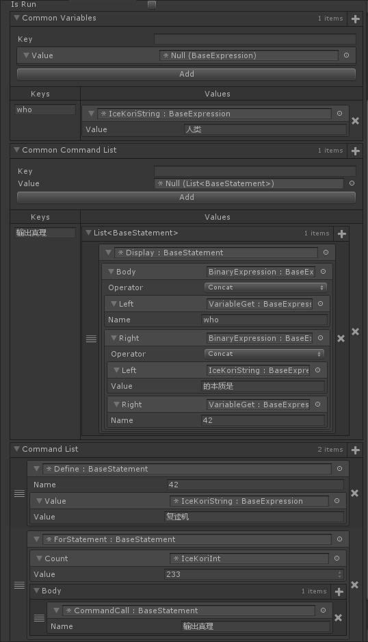
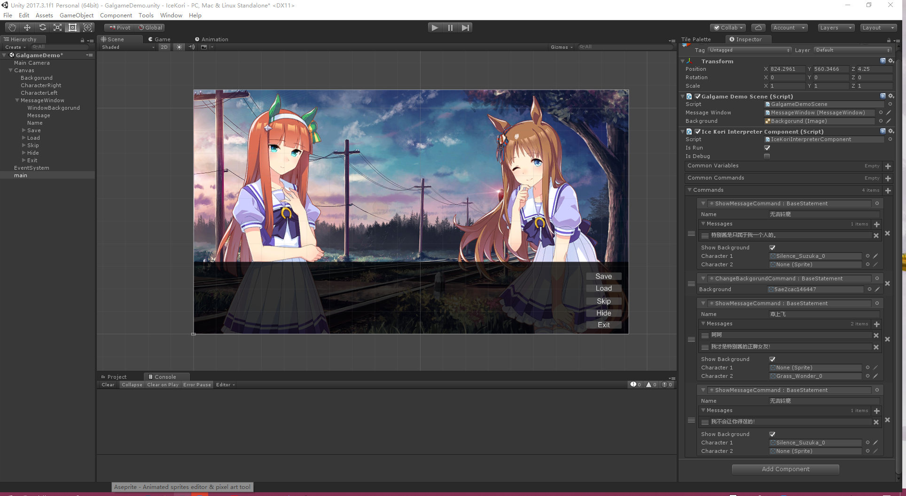

# IceKori
A simple Unity-Inspector friendly visual programming language on Unity. Lightweight logical abstraction system for game story scripts.

*Warning: IceKori depends on [Odin Inspector](http://sirenix.net/odininspector) plugin. Make sure you have a license for [Odin Inspector](http://sirenix.net/odininspector) before using IceKori.*

## Installation
+ Download unitypackage from [Releases](https://github.com/molingyu/IceKori/releases) and import it.

## Usage
View [Documentation](./Docs/Readme.md)

## TODO
+ Prettify debug print.
+ Create IceKori Nodes from external script(e.g. json/yaml/xml).

## Demo
+ Base

+ Galgame

## LICENSE
[MIT](./LICENSE)